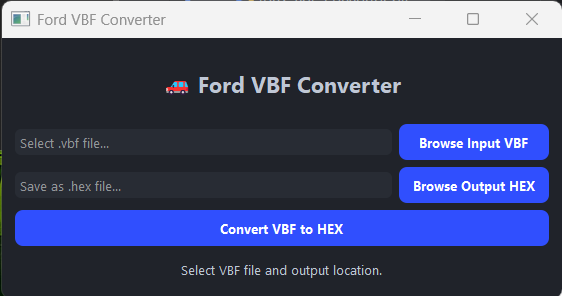

# 🚗 Ford VBF Converter

A modern, easy-to-use GUI tool for Windows and Python to convert **Ford PCM/ECU .VBF reflash files** to standard **.HEX** (Intel Hex) or **.BIN** files, ready for advanced diagnostics, custom flashing, or data analysis.

> *Screenshot: Ford VBF Converter GUI (Dark Theme)*

---
## 🆕 What’s New (July 2025)

### Major Improvements in This Release

- **Multi-Region VBF Support**  
  Converts **all** firmware/data regions from Ford `.vbf` files (not just the first). Output HEX is always 100% complete, even for complex VBFs.

- **Live Metadata Display**  
  - **Auto-parses and displays VBF info:** Version, part number, description, region table, and more, before conversion.
  - **Highlight:** See start/end addresses and size of all data regions in the file.

- **Modern, Professional UI**  
  - **Dark Theme** (High-DPI and Retina-ready)
  - **Drag & Drop Support:** Drop any `.vbf` onto the window to instantly load it.
  - **Red Exit Button** for quick closing.
  - **Copyable/Selectable fields** for power users.

- **Sound Effects**  
  - **Success and Error chimes** after conversion (loads `wav.wav` and `wav-4.wav` from the `/Sounds/` folder if present, otherwise uses system beep).
  - **Sounds stop cleanly** if you close the window during playback.

- **File Path and Extension Fixes**  
  - **Output is always `.hex`** by default (drag/drop, file browse, or manual typing).
  - **No file paths or headers** are ever added to your HEX output—only valid Intel HEX records.
  - Handles both relative and absolute paths and checks for file existence.

- **Better Input Validation & Error Handling**  
  - **Input validation** for file existence, type, and output name before running.
  - Improved error messages in the GUI and via popups.
  - Handles corrupt or incomplete VBFs gracefully.

- **Robust Cross-Platform Sound Handling**  
  - Loads sound files using safe resource paths for Windows, Mac, and Linux.

- **Ready for Power Users**  
  - All UI fields are selectable and copyable.
  - Output field is forced to `.hex` (unless you override).
  - Drag-and-drop, file browse, or type paths directly.
  - EXE is Windows only, Python script runs everywhere.

---

## Improvements & Changelog

- Converts **all** data blocks in Ford VBF files (multi-region, not just first)
- Modern, high-DPI dark UI with live firmware info, drag & drop, and copyable fields
- Red “Exit” button for quick and safe quitting
- Sound effects on success/error (with fallback to system beep if not found)
- No file paths or extraneous headers ever included in output HEX files
- Better validation for both input and output files, with error popups
- Output filename is always `.hex` by default
- Handles corrupt/incomplete VBFs and unusual files robustly
- Improved user experience, with disabled convert button during processing
- Cross-platform file path and sound resource handling

## Features

- 🔵 **Simple Drag-and-Drop or File Browse UI**
- 🔵 **Fast VBF ➔ HEX/BIN Conversion** (handles compressed Ford .vbf reflash files)
- 🔵 **No Python Needed:** Download ready-to-run EXE  
    [`Release/ford_vbf_converter.exe`](Release/ford_vbf_converter.exe)
- 🔵 **Professional, Modern UI** (High-DPI aware, Dark Mode)
- 🔵 **Status & Error Reporting**
- 🔵 **Cross-Platform** (source code runs on Windows, Linux, Mac; EXE is Windows only)
- 🔵 **Open Source & MIT Licensed**

---

## What is a VBF File?

A **.VBF (Vehicle Binary File)** is Ford's standard format for ECU/PCM firmware updates, containing data blocks, metadata, and sometimes custom scripts.  
This tool **extracts the raw firmware section** and converts it to a common HEX/BIN file for use with programmers, bootloaders, or analysis tools.

---

## Quick Start

### 🔹 Download Prebuilt Windows EXE

1. Download [`ford_vbf_converter.exe`](Release/ford_vbf_converter.exe) from the latest release.
2. **Double-click to run.** No installation or Python required.
3. Select a Ford `.vbf` file and click convert!

### 🔹 Run From Source (Python 3.10+)

1. Install Python 3.10 or newer: [Download Python](https://www.python.org/downloads/)
2. Install dependencies:
3. Download or clone this repo, and run:

---

## Usage

1. **Select Input:** Click `Browse Input VBF` and pick a Ford `.vbf` file.
2. **Select Output:** Choose where to save the resulting `.hex` file (or rename extension to `.bin` for pure binary).
3. **Convert:** Click `Convert VBF to HEX`.
4. **Done!** You'll see a success message and can now use your HEX/BIN file with other tools.

---

## Why Use This?

- **Extract firmware** from dealer flash files for reverse engineering, diagnostics, or custom tuning.
- **Convert VBF to BIN** for use with chip programmers and open-source ECUs.
- **Batch process** firmware files for automotive research.

---

## Example

| Input                  | Output                |
|------------------------|----------------------|
| `AB39-12A650-ADC.vbf`  | `AB39-12A650-ADC.hex`|
| `JK2T-14C204-CB.vbf`   | `JK2T-14C204-CB.hex` |

---

## Screenshot

---

## Advanced

### Build Your Own Windows EXE

Install [PyInstaller](https://www.pyinstaller.org/):

Build the executable:
The EXE will be created in `dist/ford_vbf_converter.exe`.  
Move or copy it to the `Release/` directory for sharing (`Release/ford_vbf_converter.exe`).

---

### Supported VBF Files

- Any **Ford PCM/ECU/TCM** `.vbf` (standard or compressed)
- Output format: **Intel HEX** (rename `.hex` to `.bin` for pure binary dump if needed)

---

## FAQ

**Q: Does this tool work on Mac or Linux?**  
A: The Python source runs anywhere with PyQt5 and Python 3.10+. The EXE is Windows only.

**Q: Can I convert files in batch?**  
A: Not yet—batch support is coming! For now, convert one file at a time via the GUI.

**Q: My file doesn't convert!**  
A: Make sure it's a standard Ford `.vbf` reflash file. Contact the developer if you find an unsupported file!

---

## Development

- Main code: [`ford_vbf_converter.py`](ford_vbf_converter.py)
- EXE build: See instructions above
- MIT License

---

## Credits

- Tool created by [ecuunlock/Keenan Laws](https://github.com/ecuunlock)

---

## License

MIT License.  
**Not affiliated with Ford Motor Company. For educational and research use.**

---
